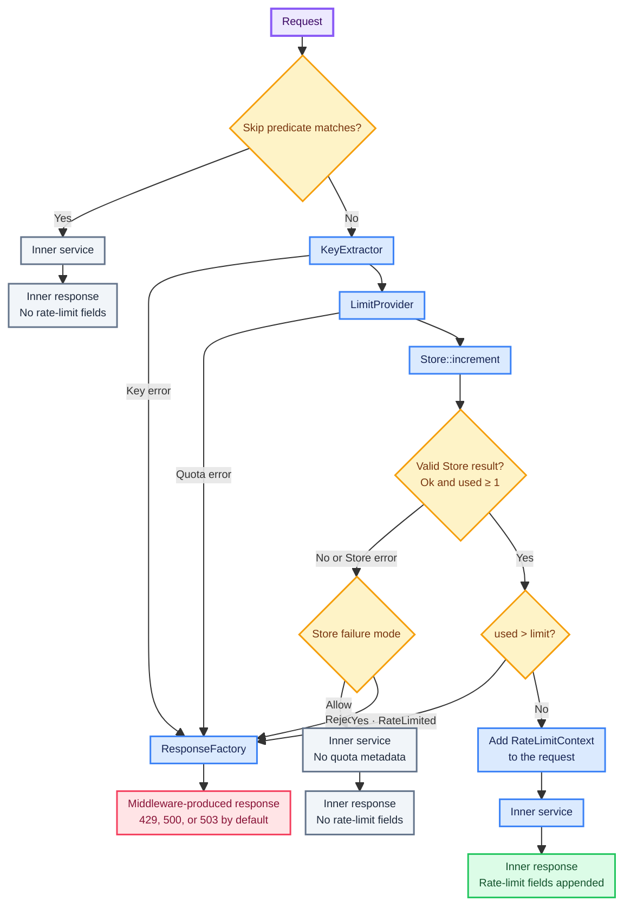

# How it works

`tower-rate-limiter` separates rate-limit policy from application concerns through four narrow
interfaces.

## The request lifecycle

For each request presented to the Layer, the service follows this order:

1. Evaluate the optional bypass predicate.
2. Extract the client key synchronously.
3. Resolve the quota, possibly asynchronously.
4. Derive the policy-scoped Store key and apply optional key encoding.
5. Atomically increment usage for the configured window.
6. Validate and evaluate returned usage.
7. Call the already-ready inner service or build an immediate response.



Charging happens before the downstream call. The middleware does not refund quota when a handler
returns an error, because the request already consumed application work.

## Client key extraction

`KeyExtractor` synchronously derives an application-owned client key from the request. The crate
does not decide whether callers are identified by an account, credential owner, peer address, or
another value.

`IpKeyExtractor` reads only a peer `SocketAddr` extension and returns its `IpAddr`; it never trusts
an HTTP field. `ClientIpKeyExtractor` uses `http-extract` to check `Forwarded`, `X-Forwarded-For`,
`X-Real-IP`, and `CF-Connecting-IP`, in that order, then falls back to the peer address. These
headers are raw assertions rather than authenticated identities. The application deployment must
ensure a trusted proxy removes or overwrites every accepted header before selecting that adapter
for security-sensitive rate limiting.

## Quota resolution

`LimitProvider` asynchronously resolves a request's quota. Calling `.limit(n)` uses a fixed `u64`,
while a custom provider can select a quota from validated request state.

Quota resolution completes before the Store is charged. Key and quota failures always reject the
request and never fail open.

## Usage storage

`Store` atomically increments a scoped key and returns:

```text
Usage { used, reset_after }
```

The Layer scopes the client key with its policy name; the window remains a separate Store argument.
Use distinct policy names when policies must not share usage.

A valid Store result always has `used >= 1`. Returning `used == 0` is treated as a Store failure and
follows the configured Store failure mode. `reset_after` is the remaining duration of the current
window, not the originally configured duration.

Store failures reject by default. Applications that explicitly prefer availability can select
`StoreFailureMode::Allow`; the inner service is then called without claiming quota metadata.

## Fixed-window behavior

The first increment starts a window. Later increments update usage but do not move its end time.
After expiry, the next charged request starts a new window.

The first `limit` charged requests are allowed. Request `limit + 1` is rejected, but still
increments usage without extending the window. This behavior is predictable and inexpensive, but
traffic may burst around a boundary: a caller can use the end of one window and the beginning of the
next in quick succession.

Sliding windows, token buckets, weighted requests, and refunds are outside the current interface.

## Responses and context

`ResponseFactory` maps middleware outcomes to the application's response body, status, headers, and
logging policy. The default factory returns:

| Outcome | Status |
| --- | --- |
| Rate limited | `429 Too Many Requests` |
| Client key failure | `500 Internal Server Error` |
| Quota failure | `500 Internal Server Error` |
| Store failure | `503 Service Unavailable` |

Allowed requests receive `RateLimitContext` in their extensions. Its policy entries contain the
policy name, resolved limit, used and remaining quota, and reset duration. The context is absent on
bypass and fail-open paths; downstream code should treat absence as “no trustworthy limiter
metadata,” not as “unlimited.”

Nested Layers append policies instead of overwriting context or response fields. See
[Rate limit fields](rate-limit-fields.md) for the wire representation.

## Request bypass

`RateLimitBuilder::skip` accepts a synchronous predicate over the request head. A bypassed request
reaches the inner service without key extraction, quota resolution, Store usage, response fields, or
`RateLimitContext`.

Only use application-trusted headers or extensions in this predicate. Prefer a validated identity
extension over matching a raw credential.

## Layer scope and composition

Where the Layer is installed determines which routes enter the policy. Use separate Layers for
separate route scopes, and give semantically different policies distinct names.

Nested limiters charge independently. If an outer policy allows the request, an inner policy may
still reject it; the outer charge is not refunded. On allowed requests, context entries and response
fields are appended in composition order.

## Tower readiness

The middleware respects Tower's readiness contract: it calls the same inner service instance that
was observed ready. Key extraction, quota resolution, and Store access happen after the service call
has begun, so application code should still apply timeouts and load-shedding at the appropriate
service boundaries.
