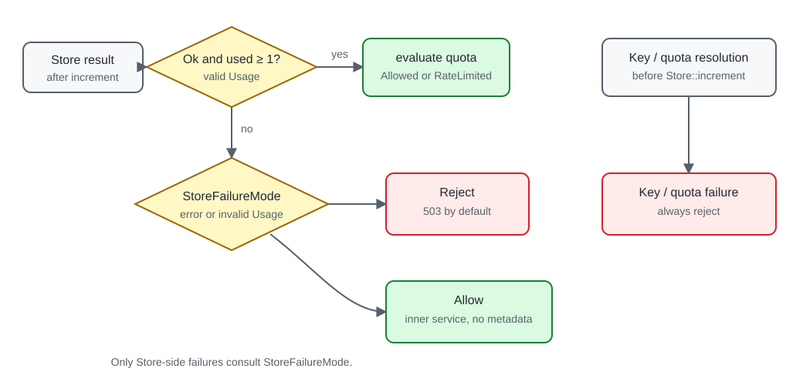

# Configuration

`RateLimitLayer::builder(...)` uses concrete generic types for the extractor, Store, quota provider,
and response factory. Most configuration is shared immutable state, so cloning a finished Layer is
cheap and produces services with the same policy.

## Builder reference

| Method | Default | Purpose |
| --- | --- | --- |
| `with_store(store)` | none | Select the required usage Store |
| `limit(n)` | `1` | Use one fixed quota for every request |
| `limit_provider(provider)` | fixed provider | Resolve a quota from each request |
| `policy_name(name)` | `default-policy` | Set the stable policy and counter identity |
| `window(duration)` | 60 seconds | Set the fixed-window duration |
| `response_factory(factory)` | empty default responses | Customize middleware-produced responses |
| `store_failure_mode(mode)` | `Reject` | Reject or fail open after Store failure |
| `rate_limit_fields(fields)` | `Draft11` | Select or disable response fields |
| `with_key_encoder(fn)` | raw scoped key | Transform the complete key before storage |
| `skip(predicate)` | never bypass | Exempt trusted requests before charging |

Calling `limit(...)`, `limit_provider(...)`, `with_store(...)`, or `response_factory(...)` replaces
the previously selected component of that kind.

## Policy identity and counter sharing

Before crossing the Store seam, the middleware scopes the extracted client key with the policy
name. Therefore Layers intentionally share a counter only when all of these match:

- the same logical Store data;
- the same policy name;
- the same extracted client key;
- equivalent key encoding.

The window is passed separately to the Store. If two policies have different windows, give them
different names even when their limits happen to match. Treat a policy name as a stable identifier,
not as display text.

## Dynamic quotas

Use `.limit_provider(...)` when the quota comes from validated request state. The provider runs
after key extraction and before Store usage:

```text
key failure       -> reject; Store not called
quota failure     -> reject; Store not called
quota resolved    -> atomically increment Store
```

A provider may return an asynchronous future, but request-local extensions are usually preferable
to repeating authentication or remote account lookup inside the limiter. See
[Custom components](custom-components.md) for the trait shape.

## Store failure mode

`StoreFailureMode::Reject` is the default. It returns the response selected by `ResponseFactory`
without calling the inner service.

`StoreFailureMode::Allow` favors availability. On a Store error—or invalid Store usage—the inner
service is called without `RateLimitContext` or rate-limit fields because no trustworthy quota
state exists. Key and quota failures never fail open.



Choose this per policy based on the cost of under-enforcement:

| Policy type | Typical starting point |
| --- | --- |
| Abuse protection on a public read endpoint | `Allow` may be acceptable |
| Login, expensive work, paid quota, or write protection | Prefer `Reject` |

This table is operational guidance, not an automatic security policy.

## Key encoding

By default, the complete scoped key is passed to the Store unchanged. Use
`.with_key_encoder(...)` when raw identities must not appear in transport keys or when a backend
needs a constrained representation.

The callback runs synchronously in the middleware future. It must be deterministic,
collision-resistant for the application's key space, non-blocking, free of I/O, and non-panicking.
The crate does not choose a hashing algorithm or detect collisions.

Changing the encoder changes counter identity. Roll it out as a policy migration: old counters will
not automatically merge into the new representation.

## Bypass

`.skip(...)` receives `&Request<()>`, which contains the request head and extensions but no body.
When it returns `true`, the request reaches the inner service without key extraction, quota
resolution, Store usage, rate-limit fields, or context.

The predicate is synchronous. Use only cheap, trusted request state such as an authentication result
or deployment-validated peer extension. Do not treat an arbitrary client-supplied header as an
allowlist signal.
