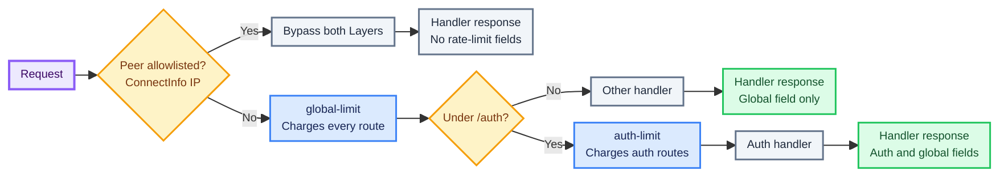

# Axum with nested policies

This example installs a global policy around the application and a stricter policy around the auth
routes. It also shows the `ConnectInfo<SocketAddr>` setup required by `IpKeyExtractor` and an IP
allowlist that bypasses both policies.



```sh
cargo run --example axum_memory --features axum,memory
```

The server listens on `http://127.0.0.1:3000`.

## Complete source

```rust,ignore
{{#include ../../examples/axum_memory.rs}}
```

An allowlisted request reaches the handler without quota metadata. A non-allowlisted request to
`/auth/login` can consume both policies; if the inner auth policy rejects it, the already-recorded
outer charge is not refunded.
